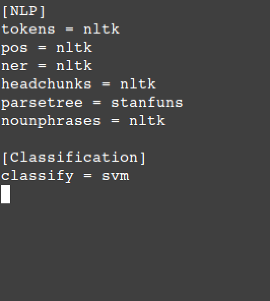
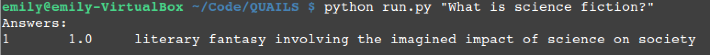

.. _ask:

=================
Asking a Question
=================

This section demonstrates how to configure Quails and ask a question.

Configuration
=============

By modifying the configuration file in ``config/quails.config``, the user can specify which tools to use for various steps in the question answering process.  Currently, the user can specify the following:

1. Which to toolkit to use for each step of the NLP pipeline, used by each component of the Quails question answering pipeline (:ref:`intro`). Current options include the Natural Language ToolKit (``nltk``) or Stanford Core NLP (``stanfuns``).
2. Which classification algorithm to use in order to predict the type of answer required by the question.  The only option in this version is a support vector machine performing multi-class classification using a one-vs-all classification strategy.  SVMs are well known to show good performance for text classification problems.

The following figure shows the anatomy of the configuration file.  The names in brackets (e.g. ``NLP``) denotes a section, and lines of form ``<property> = <value>`` denote properties and their values.  

 	Quails configuration file

It is important to note that the NLP steps will be executed in the order that they appear in the file.  Therefore, when you add or remove steps from this section, you are changing the pipeline.  Quails will validate the specified pipeline, otherwise the system will quit.

Asking a Question
=================

From the main Quails directory (containing ``run.py``), ask your question following the usage guidelines:

:: 

	python run.py <string containing a question>

Example usage is shown in the following figure.

	Quails sample question and answer 

Quails currently does not support batch processing of questions, but will be needed for experiments and so will be included in a subsequent version of the framework.
