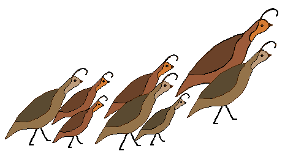

===================================
Quails Question Answering Framework
===================================

.. QUAILS documentation master file, created by
   sphinx-quickstart on Tue Mar 15 17:33:22 2016.
   You can adapt this file completely to your liking, but it should at least
   contain the root `toctree` directive.

| Quails Documentation
==================================
Welcome to the documentation pages for the QUAils Question Answering framework.  This project is meant to provide a basis for the research and implementation of a cognitive domain-specific question answering system. 

.. toctree::
   :maxdepth: 2

* :ref:`Introduction <intro>`
* :ref:`Installation <install>`
* :ref:`Asking a Question! <ask>`
* :ref:`Customizing Quails <custom>`
* :ref:`Architecture Overview <overview>`

| 

