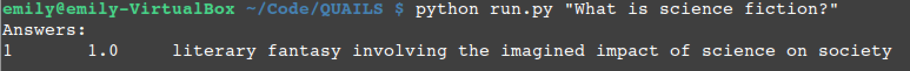

.. _intro:

============
Introduction
============

	
	Sample run of Quails

Quails is a modular question answering framework that is meant to provide a testbed for the author's dissertation work.  It has been designed to be fully customizable at every step of a user specified question answering pipeline.

Question Answering Pipeline
===========================

Each step of the Quails question answering pipeline is meant to be customizable by the user.  This means that you can choose, for example, which tools to use for the individual Natural Language Processing steps or which classification algorithms the system will use to predict the answer type of the question.  The Quails pipeline is visualized below.  Multiple aspects of each component can be configured by the user prior to asking a question (See :ref:`ask`).

	Quails question answering pipeline

Components
==========

The system is comprised of two primary parts. The first component is a Flask server providing question answering pipeline services such as NLP, classification, text indexing, answer extraction, and answer scoring.  

The second component is an interface program which receives a natural language question from the user and acts as a controller for the question answering pipeline in order to produce an answer.

Quails Architecture
===================

Multiple views of the Quails system architecture can be seen :ref:`here <overview>`.
